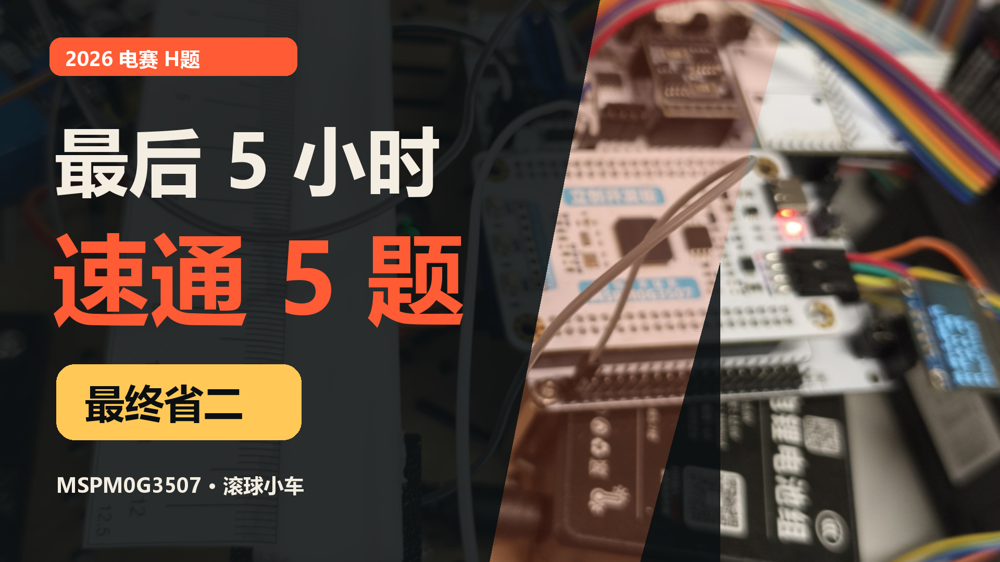

# MSPM0G3507 车载平衡滚球运动控制系统



本项目是 2026 北京赛区大学生电子设计竞赛 H 题参赛工程。系统以
MSPM0G3507 为主控，组合差速底盘、8 路灰度传感器、双编码器、BNO085、
MaixCAM 和闭环步进电机，完成循迹、停车与车载滚球控制任务。项目在比赛
最后约 5 小时完成 5 项任务调试，最终获得省二等奖。

## 核心功能

- Q2：小车沿环形黑线运行一圈并在起点停车。
- Q3：小球从中心运行至 `+5 cm`，折返至 `-5 cm` 并停稳。
- Q4：小车从 A 行驶至 B，同时将小球保持在中心附近。
- Q5：小车运行一圈，同时将小球保持在中心附近。
- Q6：小车运行一圈，同时将小球保持在赛前指定位置附近。

## 控制结构

- 灰度位置生成目标转向量。
- BNO085 提供航向与角速度反馈。
- 双编码器速度 PI 跟踪左右轮目标转速。
- 摄像头通过 UART 输出球位置。
- 滚球控制使用位置、速度估计与步进摆杆角度控制。
- OLED 和蓝牙用于现场状态显示与调试。

## 仓库结构

```text
.
|-- Firmware/    MSPM0G3507 CCS/SysConfig 固件工程
|-- Hardware/    EasyEDA Pro 扩展板工程
|-- cover.jpg    项目封面
|-- LICENSE      开源许可证
`-- README.md    本说明
```

## 硬件

- 主控：MSPM0G3507。
- 扩展板：PCB6，EasyEDA Pro 源文件位于 `Hardware/`。
- 底盘：差速轮式底盘，65 mm 车轮，编码器实测约 728 count/圈。
- 姿态：BNO085。
- 执行机构：闭环步进电机，STEP/DIR 控制。
- 视觉：MaixCAM，通过 `115200, 8N1` UART 发送 ASCII 球位置。

## 快速开始

1. 安装 Code Composer Studio 21.x、MSPM0 SDK 2.05.01.00 和 SysConfig。
2. 在 CCS 中导入 `Firmware/` 下的现有工程。
3. 检查 `Firmware/timx_timer_mode_pwm_edge_sleep.syscfg` 的器件和引脚配置。
4. 编译并下载前，架空车轮确认电机方向、编码器符号和急停按键。
5. 按实际机械尺寸重新标定灰度、轮距、步进角度和滚球控制参数。

详细模式操作、接线、参数和调试记录见：

- [`Firmware/README_MAP_RUN.md`](Firmware/README_MAP_RUN.md)
- [`Firmware/README_STEPPER_BNO085.md`](Firmware/README_STEPPER_BNO085.md)
- [`Firmware/KnowledgeBase/code_logic.md`](Firmware/KnowledgeBase/code_logic.md)
- [`Firmware/KnowledgeBase/car_parameters.md`](Firmware/KnowledgeBase/car_parameters.md)
- [`Firmware/KnowledgeBase/tuning_log.md`](Firmware/KnowledgeBase/tuning_log.md)

## 摄像头协议

MaixCAM 通过 `115200, 8N1` UART 发送 ASCII 球位置，例如：

```text
[BALL] POS:+1.2cm\r\n
```

本仓库包含 MSPM0 接收、解析和滚球控制代码；比赛现场使用的 MaixCAM
视觉模型及训练素材不在当前快照中。

## 注意

本仓库记录的是参赛现场版本。轮距、传感器高度、球杆坡度、摩擦和摄像头
坐标都会影响参数，移植到其他机械结构时必须重新标定。正式上车前请先架空
车轮验证方向、编码器符号和急停功能。

## License

项目自有代码采用 MIT License。BNO085 SH-2 等第三方模块仍遵守其目录中
附带的原始许可证与通知文件。
